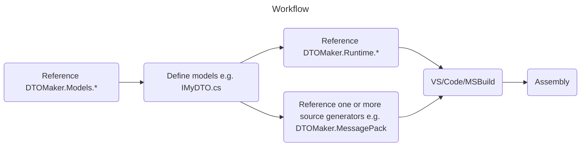

[](https://github.com/datafac/dtomaker-core/actions/workflows/dotnet.yml)
[](https://github.com/datafac/dtomaker-core/actions/workflows/github-code-scanning/codeql)

*Warning: This is pre-release software under active development. Breaking changes may occur.*

<!--TOC-->
- [DTOMaker](#dtomaker)
  - [Workflow](#workflow)
- [Included Packages](#included-packages)
  - [DTOMaker.Models](#dtomaker.models)
  - [DTOMaker.JsonNewtonSoft](#dtomaker.jsonnewtonsoft)
  - [DTOMaker.MessagePack](#dtomaker.messagepack)
  - [DTOMaker.Models.MessagePack](#dtomaker.models.messagepack)
  - [DTOMaker.MemBlocks](#dtomaker.memblocks)
  - [DTOMaker.Models.MemBlocks](#dtomaker.models.memblocks)
  - [DTOMaker.CSPoco](#dtomaker.cspoco)
  - [DTOMaker.Runtime](#dtomaker.runtime)
- [Model features](#model-features)
  - [MemBlocks features](#memblocks-features)
- [!Limitations](#limitations)
  - [Single compilation unit](#single-compilation-unit)
- [Development](#development)
  - [In progress](#in-progress)
  - [Coming soon](#coming-soon)
  - [Coming later](#coming-later)
<!--/TOC-->

# DTOMaker

This repo includes model-driven compile-time source generators for quickly creating DTOs (Data Transport Objects) supporting the following
serialization schemes:
- MessagePack
- MemBlocks
- JSON (NewtonSoft)

and related POCOs (Plain Old C# Objects).

## Workflow


Models are defined as C# interfaces with additional attributes. Here's a trivial example:

```C#
[Entity][Id(1)]
public interface IMyFirstDTO
{
    [Member(1)] string Name { get; set; }
}
```
If using the MessagePack source generator, the following implmentation will be 
generated (simplified):

```C#
[MessagePackObject]
public sealed class MyFirstDTO : EntityBase, IMyFirstDTO, IEquatable<MyFirstDTO>
{
    [Key(1)] string Name { get; set; }
}
```
# Included Packages

This repo includes the following packages:

## DTOMaker.Models
Attributes for defining simple data models as interfaces in C#.

## DTOMaker.JsonNewtonSoft
A source generator that creates DTOs (Data Transport Objects) that are serializable to JSON 
using the Newtonsoft.Json package.

## DTOMaker.MessagePack
A source generator that creates MessagePack DTOs (Data Transport Objects).
See https://github.com/MessagePack-CSharp/MessagePack-CSharp.
## DTOMaker.Models.MessagePack
Additional attributes used by the DTOMaker.MessagePack source generator, to manage
MessagePack entity and member keys.

## DTOMaker.MemBlocks
Generates DTOs whose internal data is a single memory block (Memory\<byte\>). Property getters and setters decode and encode
values directly to the block with little-endian (default) or big-endian byte ordering.
## DTOMaker.Models.MemBlocks
Additional attributes used by the DTOMaker.MemBlocks source generator, to 
manage entity and member memory layout.

## DTOMaker.CSPoco
Generates basic POCOs (Plain Old C# Objects) that implement the model interfaces.

## DTOMaker.Runtime
Common types used at runtime by DTOMaker generated entities.

# Model features
- Member value types: Boolean, S/Byte, U/Int16/32/64/128, Double, Single, Half, Char, Guid, Decimal
- String member types.
- Binary member types:
  - Octets (model interfaces, CSPoco, CSRecord, MemBlocks)
  - ReadOnlyMemory\<byte\> (MessagePack)
  - byte[] (JsonNewtonSoft)
- polymorphic types
- entity members
- Built-in freezability (mutable until frozen) support
- [Obsolete] members
- Fixed length arrays of above value types.
- IEquatable\<T\> support
- Templates as testable code, template-to-generator processing.

## MemBlocks features
- auto-embedded string, binary and entity members when encoded < 63 bytes.
- fixed-length string and binary member types.

# !Limitations
## Single compilation unit
All models and generated DTOs are contained within a single assembly.
Models cannot reference types in other projects or packages (other 
than native or built-in types). Generated classes are partial, which can help you 
mitigate the single assembly constraint.

# Development
## In progress
- generic (template) model types
- custom struct members (to avoid primitive obsession)

## Coming soon
- Json (System.Text) generator
- upgrade source generators to IIncrementalGenerator
- global interface equality comparer
- reservation (hidden members)
- Orleans generator
- ProtobufNet 3.0 generator
- MessagePack 3.x generator
- NetStrux generator
- MemBlocks compact layout method
- Enum data types. Workaround - enums can be implemented with an underlying 
  integer property and a cast.
- MemBlocks nullable types. Workaround - T? can be implemented with a pair
  of members (Boolean, T).

## Coming later
- Google Protobuf .proto generation
- model.json generation
- command-line alternative
- variable length arrays
- logical value equality
- Rune member types
